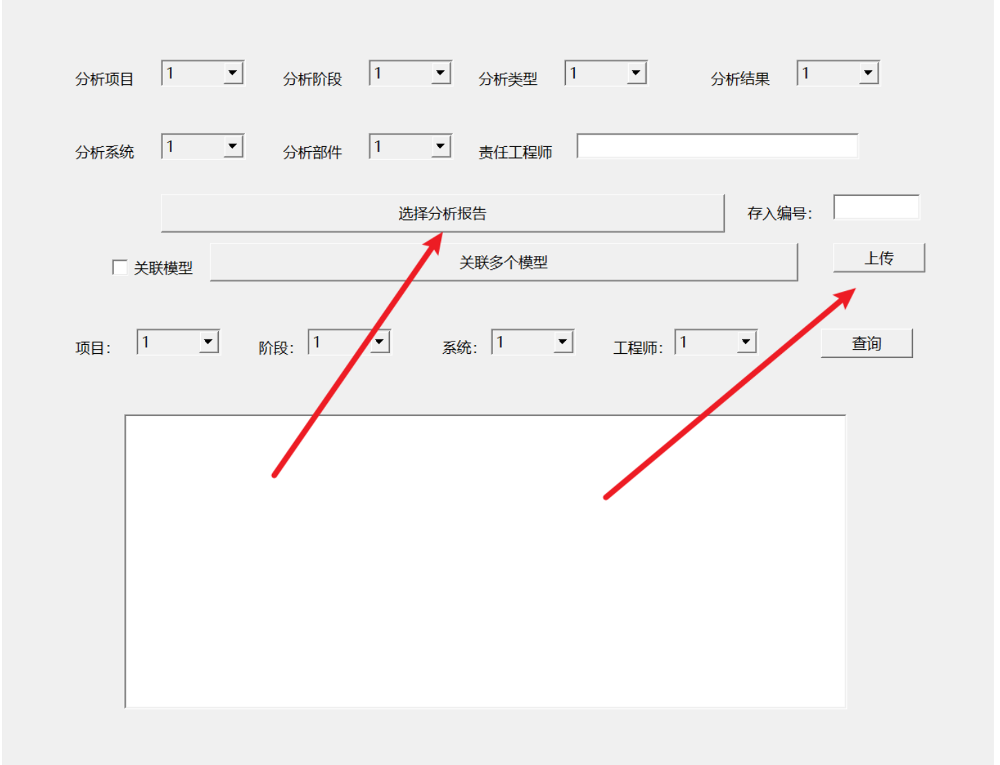
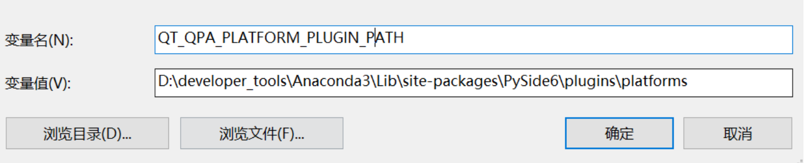

# demo完成的功能



在选择分析报告中选择本地一个文件，然后点击上传到指定文件夹，在本地windows机器模拟与服务器的文件上传下载。
首先执行server.py  接着执行ui_titled.py 


# 环境需求

python版本：3.9

pyqt版本：pyqt6

安装命令

```
pip install -i https://pypi.tuna.tsinghua.edu.cn/simple pyqt6
pip install -i https://pypi.tuna.tsinghua.edu.cn/simple PySide6
```

# 报错信息解决方法


添加环境变量即可



```
QT_QPA_PLATFORM_PLUGIN_PATH
D:\developer_tools\Anaconda3\Lib\site-packages\PySide6\plugins\platforms
```

# 学习参考链接

https://blog.csdn.net/qq_37193537/article/details/91043580

https://www.jb51.net/article/215587.htm
